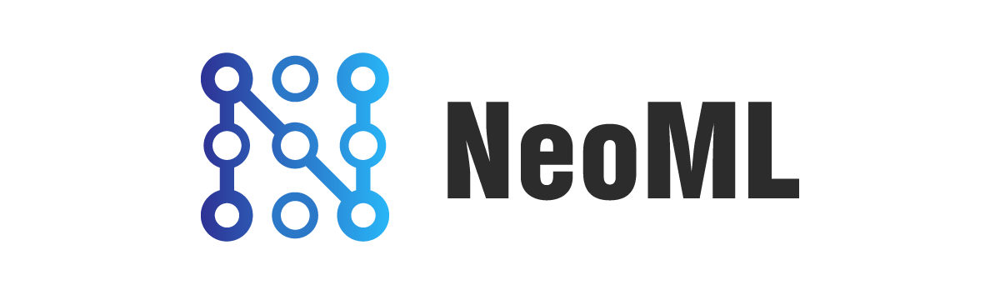

**NeoML** is an end-to-end machine learning framework that allows you to build, train, and deploy ML models. This framework is used by ABBYY engineers for computer vision and natural language processing tasks, including image preprocessing, classification, document layout analysis, OCR, and data extraction from structured and unstructured documents.

Key features:

- Neural networks with support for over 100 layer types
- Traditional machine learning: 20+ algorithms (classification, regression, clustering, etc.)
- CPU and GPU support, fast inference
- ONNX support
- Languages: C++, Java, Objective-C
- Cross-platform: the same code can be run on Windows, Linux, macOS, iOS, and Android

## Contents

<!-- TOC -->

- [Build and install](#build-and-install)
	- [Supported platforms](#supported-platforms)
	- [Third party](#third-party)
	- [Build fully functional C++ version](#build-fully-functional-c++-version)
	- [Build inference versions for Java and Objective-C](#build-inference-versions-for-java-and-objective-c)
- [Getting started](#getting-started)
- [API description](#api-description)
	- [Basic principles](#basic-principles)
		- [Platform independence](#platform-independence)
		- [Math engines independence](#math-engines-independence)
		- [Multi-threading support](#multi-threading-support)
		- [ONNX support](#onnx-support)
		- [Serialization format](#serialization-format)
		- [GPU support](#gpu-support)
		- [FineObj](#fineobj)
	- [C++ interface](#c++-interface)
		- [Algorithms library NeoML](#algorithms-library-neoml)
		- [NeoMathEngine](#neomathengine)	
	- [Java interface](#java-interface)
	- [Objective-C interface](#objective-c-interface)
- [License](#license)

<!-- /TOC -->

## Build and install

### Supported platforms

The full С++ library version has been tested on the platforms:

|Target OS|Compiler|Architecture|
|----------|----------|------------------------------|
|Windows 7+ (CPU and GPU)|MSVC 2015+|x86, x86_64|
|Ubuntu 14+ (CPU)|gcc 5.4+|x86_64|
|MacOS 10.11+ (CPU)|Apple clang 11+|x86_64|
|iOS 11+ (CPU, GPU)|Apple clang 11+|arm64-v8a, x86_64|
|Android 5.0+ (CPU), Android 7.0+ (GPU)|clang 7+|armeabi-v7a, arm64-v8a, x86, x86_64|

The inference Java and Objective-C library versions have been tested on the platforms:

|Target OS|Compiler|Architecture|
|----------|----------|------------------------------|
|iOS 11+ (CPU, GPU)|Apple clang 11+|arm64-v8a, x86_64|
|Android 5.0+ (CPU), Android 7.0+ (GPU)|clang 7+|armeabi-v7a, arm64-v8a, x86, x86_64|

### Third party

The library is built with [CMake](https://cmake.org/download/) (recommended versions 3.11 and later).

For best CPU performance on Windows, Linux and macOS we use [Intel MKL](https://software.intel.com/en-us/mkl).

When processing on a GPU, you can optionally use [CUDA](https://developer.nvidia.com/cuda-downloads) (version 10.2) on Windows and [Vulkan](https://vulkan.lunarg.com/sdk/home) (version 1.1.130 and later) on Android.

We also use Google [Test](https://github.com/google/googletest) for testing and Google [Protocol Buffers](https://developers.google.com/protocol-buffers) for working with ONNX model format.

### Build fully functional C++ version

See [here](NeoML/docs/en/Installation/cpp.md) for instructions on building the C++ library version for different platforms.

### Build inference versions for Java and Objective-C

See [here](NeoML/docs/en/Installation/inference.md) for instructions on building the Java and Objective-C versions that would only run the trained neural networks.

## Getting started

Several tutorials with sample code will help you start working with the library:

- [Train and use a simple network](NeoML/docs/en/Tutorial/SimpleNet.md)
- [Classification with gradient boosting](NeoML/docs/en/Tutorial/News20Classification.md)
- [Data clustering with k-means algorithm](NeoML/docs/en/Tutorial/IrisClustering.md)

## API description

### Basic principles

The library was developed with these principles in mind:

#### Platform independence

The user interface is completely separated from the low-level calculations implemented by a math engine. 

The only thing you have to do is to specify at the start the type of the math engine that will be used for calculations. You can also choose to select the math engine automatically, based on the device configuration detected.

The rest of your machine learning code will be the same regardless of the math engine you choose.

#### Math engines independence

Each network works with one math engine instance, and all its layers should have been created with the same math engine. If you have chosen a GPU math engine, it will perform all calculations. This means you may not choose to use a CPU for "light" calculations like adding vectors and a GPU for "heavy" calculations like multiplying matrices. We have introduced this restriction to avoid unnecessary synchronizations and data exchange between devices.

#### Multi-threading support

The [math engine interface](NeoML/docs/en/API/NN/MathEngine.md) is thread-safe; the same instance may be used in different networks and different threads.

Note that this may entail some synchronization overhead.

However, the [neural network implementation](NeoML/docs/en/API/NN/Dnn.md) is not thread-safe; the network may run only in one thread.

#### ONNX support

**NeoML** library also works with the models created by other frameworks, as long as they support the [ONNX](https://onnx.ai/) format. See [the description of import API](NeoML/docs/en/Onnx.md). However, you cannot export a NeoML-trained model into ONNX format.

#### Serialization format

The library uses its own binary format (implemented by `CArchive`, `CArchiveFile`) to save and load the trained models. 

#### GPU support

Processing on GPU often helps significantly improve performance of mathematical operations. The **NeoML** library uses GPU both for training and running the models. This is an optional setting and depends on the hardware and software capabilities of your system. 

To work on GPU, the library requires:

- Windows: NVIDIA® GPU card with CUDA® 10.2 support.
- iOS: Apple GPU A7+.
- Android: devices with Vulkan 1.0 support.
- Linux/macOS: no support for GPU processing as yet. 

#### FineObj

The **NeoML** library originates in ABBYY internal infrastructure. For various reasons ABBYY uses a cross-platform framework called FineObj. Because of this, the open library version uses some of this framework primitives. See the [common classes description](NeoML/docs/en/API/Common/README.md).

### C++ interface 

**NeoML** contains two C++ libraries:

#### Algorithms library NeoML

The library provides C++ objects that implement various high-level algorithms. It consists of several parts:

- [Neural networks](NeoML/docs/en/API/NN/README.md)
- [Classification and regression algorithms](NeoML/docs/en/API/ClassificationAndRegression/README.md)
- [Clustering algorithms](NeoML/docs/en/API/Clustering/README.md)
- [Auxiliary algorithms](NeoML/docs/en/API/Algorithms/README.md)

#### NeoMathEngine

The math engine used for calculations is a separate module that implements the low-level mathematical functions used in the algorithms library. The user can also call these functions but usually never needs to.

This module has different implementations for different platforms. In particular, there is an implementation that uses a GPU for calculations.

The math engine is also a set of C++ interfaces described [here](NeoML/docs/en/API/NN/MathEngine.md).

### Java interface

To work with the inference version of the library in Java and Kotlin we provide a [Java interface](NeoML/docs/en/Wrappers/Java.md).

### Objective-C interface

To work with the inference version of the library in Swift and Objective-C we provide an [Objective-C interface](NeoML/docs/en/Wrappers/ObjectiveC.md).

## License
Copyright © 2016-2020 ABBYY Production LLC. Licensed under the Apache License, Version 2.0. See [the license file](LICENSE).
